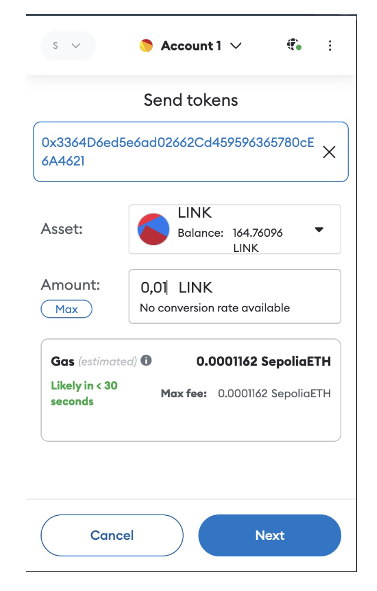
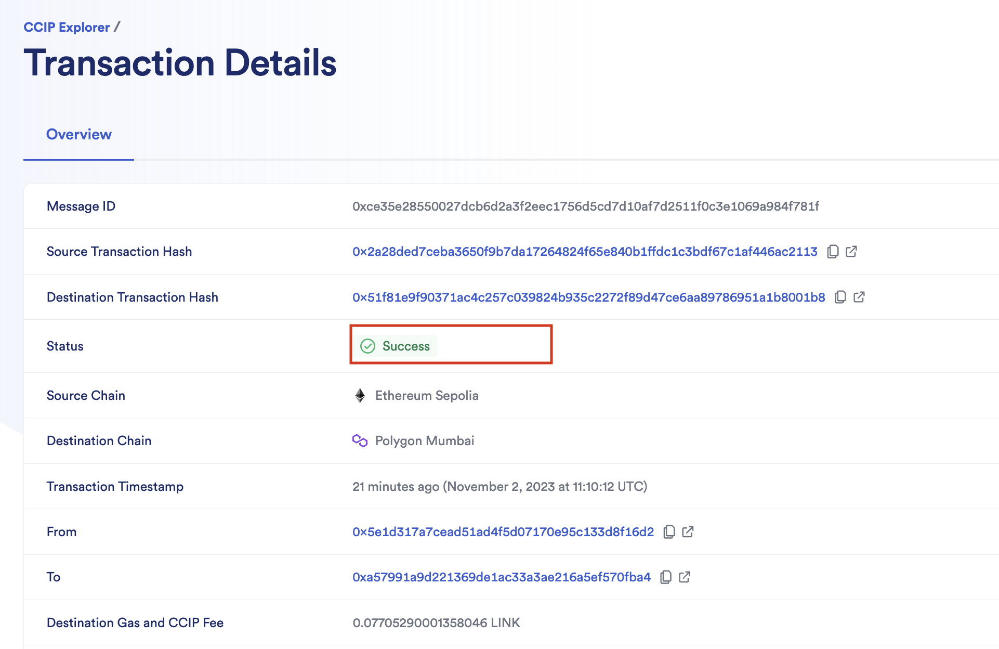
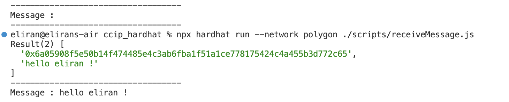

### Sample Hardhat Project

This project demonstrates a basic Hardhat use case. It comes with a sample contract, a test for that contract, and a script that deploys that contract.

Try running some of the following tasks:

```shell
npx hardhat help
npx hardhat test
REPORT_GAS=true npx hardhat test
npx hardhat node
npx hardhat run scripts/deploy.js
```


***CCIP Getting Started***

A simple use case for Chainlink CCIP is [sending data](https://docs.chain.link/ccip/getting-started) between smart contracts on different blockchains. This guide shows you how to deploy a CCIP sender contract and a CCIP receiver contract to two different blockchains and send data from the sender contract to the receiver contract. You pay the CCIP fees using LINK.


***Note:***

* Please make sure to caputre the ***Sender contract address*** after deployed since you will need to use it for the following steps

* Please make sure to caputre the ***Receiver contract address*** after deployed since you will need to use it for the following steps


##### Steps: 


1. Compile your contract.
2. [Deploy](https://docs.chain.link/ccip/getting-started#deploy-the-sender-contract) the sender contract on Ethereum Sepolia. 
3. Open MetaMask and [send](https://docs.chain.link/ccip/getting-started#deploy-the-receiver-contract) 0.01 LINK to the contract address that you copied. Your contract will pay CCIP fees in LINK.
4. Deploy the receiver contract on Polygon network. 
5. [Send Data](https://docs.chain.link/ccip/getting-started#send-data) (message) from the sender on Sepolia network to the Polygon networn 
6. [Read Data](https://docs.chain.link/ccip/getting-started#read-data) recived by the receiver contract on Polygon network 


***Compile the contracts***
```
    npx hardhat compile
```


***Deploy Sender contract***
Call the following command below, make sure you set the network to the **sepolia** network

```
    npx hardhat run scripts/deploy-sender.js --network sepolia
```

***Deploy Receiver contract***
Call the following command below, make sure you set the network to the **polygon** network

    
```
    npx hardhat run scripts/deploy-receiver.js --network polygon
```

***Send Data***
Call the following command below, make sure you set the network to the **sepolia** network
```
    npx hardhat run --network sepolia ./scripts/sendMessage.js
```

***Read Data***
Call the following command below, make sure you set the network to the **polygon** network
```
    npx hardhat run --network polygon ./scripts/receiveMessage.js 
```


##### Send Link token to pay for the gas to send the message

 

##### CCIP Explorer to view the transaction state


 

##### Review the messgae on the ploygon network 




https://hardhat.org/hardhat-runner/docs/getting-started#overview

If you want to connect Hardhat to this node, for example to run a deployment script against it, you simply need to run it using 

--network localhost.

To try this, start a node with npx hardhat node and re-run the deployment script using the network option:

npx hardhat run scripts/deploy.js --network localhost

### Eliran note 

***Sender deployed to:***
    0x8998Ab03B7E4c72a92251854676629Dd5Fee4b85

***Receiver deployed to:***
    0xbe2155C150A3A6c87a7afe85D2c9BB1981805fcF

***Can view the contract deployed:*** 
https://sepolia.etherscan.io/address/0x8998Ab03B7E4c72a92251854676629Dd5Fee4b85#readContract

***Can view the contract deployed:***
https://mumbai.polygonscan.com/address/0xbe2155C150A3A6c87a7afe85D2c9BB1981805fcF


***Send Link to the sender contract address to pay for gas fees***
https://docs.chain.link/ccip/getting-started

***Open MetaMask and send LINK to the contract address that you copied. Your contract will pay CCIP fees in LINK.***

Start the hard hardhat node for local deployment 

```
    npx hardhat node
    Started HTTP and WebSocket JSON-RPC server at http://127.0.0.1:8545/
```

***Local hardhat node blockchain accounts:***

```
WARNING: These accounts, and their private keys, are publicly known.
Any funds sent to them on Mainnet or any other live network WILL BE LOST.

Account #0: 0xf39Fd6e51aad88F6F4ce6aB8827279cffFb92266 (10000 ETH)
Private Key: 0xac0974bec39a17e36ba4a6b4d238ff944bacb478cbed5efcae784d7bf4f2ff80

Account #1: 0x70997970C51812dc3A010C7d01b50e0d17dc79C8 (10000 ETH)
Private Key: 0x59c6995e998f97a5a0044966f0945389dc9e86dae88c7a8412f4603b6b78690d

Account #2: 0x3C44CdDdB6a900fa2b585dd299e03d12FA4293BC (10000 ETH)
Private Key: 0x5de4111afa1a4b94908f83103eb1f1706367c2e68ca870fc3fb9a804cdab365a

Account #3: 0x90F79bf6EB2c4f870365E785982E1f101E93b906 (10000 ETH)
Private Key: 0x7c852118294e51e653712a81e05800f419141751be58f605c371e15141b007a6

Account #4: 0x15d34AAf54267DB7D7c367839AAf71A00a2C6A65 (10000 ETH)
Private Key: 0x47e179ec197488593b187f80a00eb0da91f1b9d0b13f8733639f19c30a34926a

Account #5: 0x9965507D1a55bcC2695C58ba16FB37d819B0A4dc (10000 ETH)
Private Key: 0x8b3a350cf5c34c9194ca85829a2df0ec3153be0318b5e2d3348e872092edffba

Account #6: 0x976EA74026E726554dB657fA54763abd0C3a0aa9 (10000 ETH)
Private Key: 0x92db14e403b83dfe3df233f83dfa3a0d7096f21ca9b0d6d6b8d88b2b4ec1564e

Account #7: 0x14dC79964da2C08b23698B3D3cc7Ca32193d9955 (10000 ETH)
Private Key: 0x4bbbf85ce3377467afe5d46f804f221813b2bb87f24d81f60f1fcdbf7cbf4356

Account #8: 0x23618e81E3f5cdF7f54C3d65f7FBc0aBf5B21E8f (10000 ETH)
Private Key: 0xdbda1821b80551c9d65939329250298aa3472ba22feea921c0cf5d620ea67b97

Account #9: 0xa0Ee7A142d267C1f36714E4a8F75612F20a79720 (10000 ETH)
Private Key: 0x2a871d0798f97d79848a013d4936a73bf4cc922c825d33c1cf7073dff6d409c6

Account #10: 0xBcd4042DE499D14e55001CcbB24a551F3b954096 (10000 ETH)
Private Key: 0xf214f2b2cd398c806f84e317254e0f0b801d0643303237d97a22a48e01628897

Account #11: 0x71bE63f3384f5fb98995898A86B02Fb2426c5788 (10000 ETH)
Private Key: 0x701b615bbdfb9de65240bc28bd21bbc0d996645a3dd57e7b12bc2bdf6f192c82

Account #12: 0xFABB0ac9d68B0B445fB7357272Ff202C5651694a (10000 ETH)
Private Key: 0xa267530f49f8280200edf313ee7af6b827f2a8bce2897751d06a843f644967b1

Account #13: 0x1CBd3b2770909D4e10f157cABC84C7264073C9Ec (10000 ETH)
Private Key: 0x47c99abed3324a2707c28affff1267e45918ec8c3f20b8aa892e8b065d2942dd

Account #14: 0xdF3e18d64BC6A983f673Ab319CCaE4f1a57C7097 (10000 ETH)
Private Key: 0xc526ee95bf44d8fc405a158bb884d9d1238d99f0612e9f33d006bb0789009aaa

Account #15: 0xcd3B766CCDd6AE721141F452C550Ca635964ce71 (10000 ETH)
Private Key: 0x8166f546bab6da521a8369cab06c5d2b9e46670292d85c875ee9ec20e84ffb61

Account #16: 0x2546BcD3c84621e976D8185a91A922aE77ECEc30 (10000 ETH)
Private Key: 0xea6c44ac03bff858b476bba40716402b03e41b8e97e276d1baec7c37d42484a0

Account #17: 0xbDA5747bFD65F08deb54cb465eB87D40e51B197E (10000 ETH)
Private Key: 0x689af8efa8c651a91ad287602527f3af2fe9f6501a7ac4b061667b5a93e037fd

Account #18: 0xdD2FD4581271e230360230F9337D5c0430Bf44C0 (10000 ETH)
Private Key: 0xde9be858da4a475276426320d5e9262ecfc3ba460bfac56360bfa6c4c28b4ee0

Account #19: 0x8626f6940E2eb28930eFb4CeF49B2d1F2C9C1199 (10000 ETH)
Private Key: 0xdf57089febbacf7ba0bc227dafbffa9fc08a93fdc68e1e42411a14efcf23656e

```

WARNING: These accounts, and their private keys, are publicly known.
Any funds sent to them on Mainnet or any other live network WILL BE LOST.

